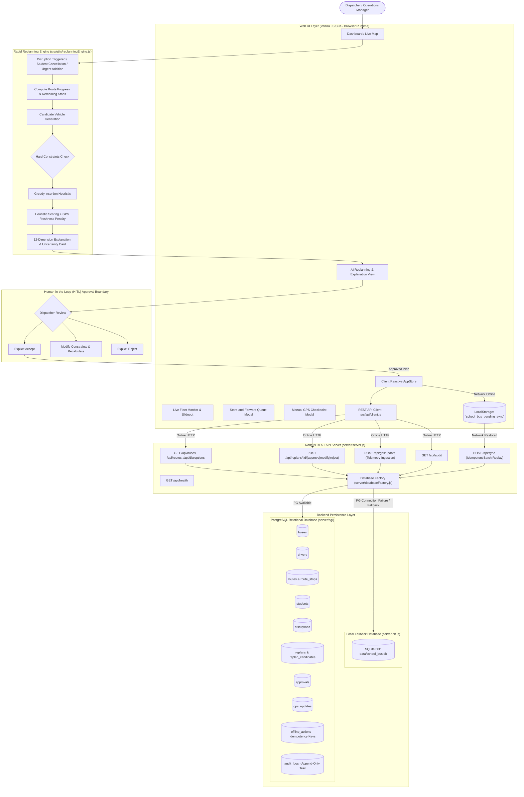
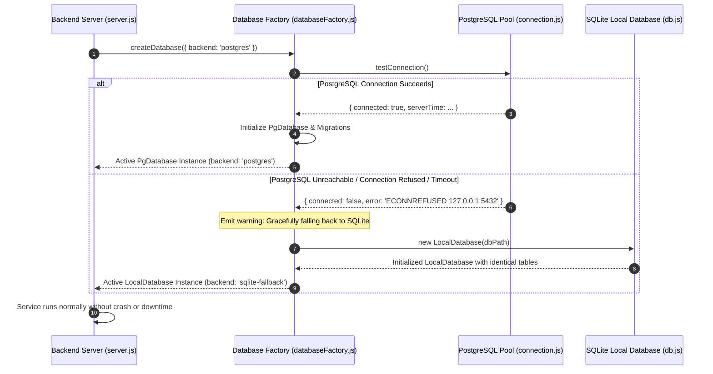

# System Architecture & Fallback Flow Documentation (MVP Demonstration Architecture)

This document details the functional architecture, operational pipeline, human-in-the-loop (HITL) replanning workflow, backend REST API, and PostgreSQL database persistence layer with hardened offline fallback subsystems for the School Bus Rapid Replanning & Responsible AI System.

---

> [!IMPORTANT]
> ### Architectural Reality Notice & Implementation Scope
> 1. **Backend REST API & Persistence Layer:** The system includes a local Node.js REST API backend (`server/server.js`) connected to an isolated **PostgreSQL database layer** (`server/pg/`) with schema migrations (`server/pg/migrations/001_initial_schema.sql`), seed fixtures (`server/pg/seed.js`), and isolated repository/service abstractions.
> 2. **Graceful Connection Fallback:** If PostgreSQL is unreachable or connection fails, the backend database factory (`server/databaseFactory.js`) catches the failure, logs a diagnostic warning, and **gracefully falls back to the local SQLite database** (`data/school_bus.db` / `server/db.js`) without disrupting operations or losing data.
> 3. **Offline / Client Resilience:** The web client continues to support offline execution via its reactive store (`src/state/store.js`) and store-and-forward action queue in browser `localStorage` (`school_bus_pending_sync`).
> 4. **No Production Cloud Deployment Claimed:** This implementation is an **MVP demonstration database layer**. No production cloud deployment (e.g. AWS RDS, Google Cloud SQL, managed Kubernetes cluster, or public TLS gateway) is claimed.

---

## 1. Architectural Implementation Matrix

| # | Architectural Dimension | Current Codebase Status | Architectural Classification | Detailed Implementation Description |
| :-: | :--- | :--- | :--- | :--- |
| **1** | **Backend REST Server** | **Implemented (Local MVP)** | **IMPLEMENTED NOW** | Node.js built-in HTTP server (`server/server.js`) providing CORS, JSON body streaming, and 15 REST endpoints for fleet entities, replans, approvals, telemetry, and batch sync. |
| **2** | **Central REST API** | **Implemented (Local MVP)** | **IMPLEMENTED NOW** | Endpoints (`GET /api/buses`, `GET /api/routes`, `POST /api/disruptions`, `POST /api/replans`, `POST /api/replans/:id/approve`, `POST /api/sync`, `POST /api/gps/update`, `GET /api/audit`, `GET /api/health`). |
| **3** | **PostgreSQL Persistence** | **Implemented (Local MVP)** | **IMPLEMENTED NOW** | Complete PostgreSQL relational database layer (`server/pg/`) with 11 tables, normalized route stops, candidates, approvals, telemetry, offline actions, and immutable audit logs. |
| **4** | **Connection Fallback** | **Implemented & Verified** | **IMPLEMENTED NOW** | `server/databaseFactory.js` catches connection drops/timeouts/errors from PostgreSQL and gracefully switches backend to local SQLite without crashing. |
| **5** | **Client LocalStorage Queue** | **Implemented & Verified** | **IMPLEMENTED NOW** | Store-and-Forward queue persisted in browser `localStorage` under `school_bus_pending_sync` (9-attribute schema) and `school_bus_synced_actions` idempotency cache. |
| **6** | **Idempotent Synchronization** | **Implemented & Verified** | **IMPLEMENTED NOW** | Unique client `actionId` keys validated at database constraint level (`offline_actions.action_id` primary key) and application level, preventing duplicate side effects. |
| **7** | **GPS Telematics Ingestion** | **Implemented & Simulated** | **IMPLEMENTED NOW (MVP)** | 5-state GPS telematics degradation (`LIVE`, `LAST_KNOWN`, `STALE`, `NO_SIGNAL`, `MANUAL`), age counters, uncertainty penalties, manual checkpoint coordinate input, and `gps_updates` persistence. |
| **8** | **Map & Road Routing** | **Leaflet + Planar Math** | **IMPLEMENTED NOW** | Geospatial map rendering using Leaflet with OpenStreetMap tiles. Route distances estimated via planar coordinate geometry scaled by California latitude/longitude constants and urban circuity multiplier ($1.30$). |
| **9** | **Role-Based HITL Approval** | **Implemented (MVP Switcher)** | **IMPLEMENTED NOW** | Dispatcher HITL interface with role switcher (Dispatcher, Admin, Driver, Parent, Observer). Explicit Accept, Modify, and Reject controls before applying mutations. |
| **10** | **Cloud Production Deployment** | **Not Deployed** | **FUTURE PRODUCTION WORK** | Enterprise cloud hosting (AWS RDS, TimescaleDB cloud, Kafka, OAuth 2.0 / SAML SSO, Kubernetes) represents future production work. |

---

## 2. System Architecture Flowchart



---

## 3. Database Layer Repository Pattern

To keep the database layer isolated and prevent SQL leaking into business logic, all database access is mediated by repository classes:

```text
Backend REST Server (server/server.js)
        ↓
Database Service Facade (server/pg/db.js: PgDatabase)
        ↓
┌─────────────────────────┬─────────────────────────┬─────────────────────────┐
│ BusRepository           │ DriverRepository        │ RouteRepository         │
│ (buses table)           │ (drivers table)         │ (routes & route_stops)  │
├─────────────────────────┼─────────────────────────┼─────────────────────────┤
│ StudentRepository       │ DisruptionRepository    │ ReplanRepository        │
│ (students table)        │ (disruptions table)     │ (replans & candidates)  │
├─────────────────────────┼─────────────────────────┼─────────────────────────┤
│ ApprovalRepository      │ GpsRepository           │ OfflineActionRepository │
│ (approvals table)       │ (gps_updates table)     │ (offline_actions table) │
├─────────────────────────┴─────────────────────────┴─────────────────────────┤
│ AuditLogRepository (audit_logs table - append-only)                         │
└─────────────────────────────────────────────────────────────────────────────┘
        ↓
PostgreSQL Connection Pool (server/pg/connection.js)
        ↓
PostgreSQL 14+ Relational Engine / Local SQLite Fallback
```

### Key Responsibilities of Each Repository:

1. **`BusRepository`**: Manages vehicle assets, fuel/battery level, driver/route associations, speed, coordinates, and GPS telemetry state.
2. **`DriverRepository`**: Manages certified drivers, availability status, shift windows, and contact credentials.
3. **`RouteRepository`**: Manages scheduled manifests, stops, sequencing order (`route_stops`), arrival ETAs, and delay calculations.
4. **`StudentRepository`**: Manages passenger manifests, pickup coordinates, special accommodations (e.g. Wheelchair Lift), and transit assignments.
5. **`DisruptionRepository`**: Manages reported incidents, severity classifications, and tracks staged vs. committed states.
6. **`ReplanRepository`**: Manages AI replanning results, evaluated candidate vehicles (`replan_candidates`), scores, and constraint pass/fail reasons.
7. **`ApprovalRepository`**: Stores human dispatcher approvals, modifications, and rejections with mandatory justification text.
8. **`GpsRepository`**: Records incoming vehicle telematics updates, trust levels, and speed/heading metrics into `gps_updates`.
9. **`OfflineActionRepository`**: Guarantees transaction idempotency by tracking client-generated `action_id` keys in `offline_actions`.
10. **`AuditLogRepository`**: Maintains an append-only, tamper-evident audit record of all state transitions and dispatcher interventions.

---

## 4. Graceful Connection Failure & Fallback Sequence



---

## 5. Architectural Guarantees & Invariants

1. **Zero Business Logic Rewrites:** The Greedy Insertion replanning algorithm (`src/utils/replanningEngine.js`) and candidate evaluation logic remain untouched.
2. **Idempotent Deduplication:** Unique `actionId` matching guarantees that duplicate sync requests or retry bursts never execute side effects twice.
3. **Strict Audit Trail Append-Only:** `audit_logs` records cannot be updated or purged via standard application flows.
4. **Dual-Layer Fallback:** The system provides both database-level fallback (PostgreSQL $\rightarrow$ SQLite) and client-level fallback (Online $\rightarrow$ browser `localStorage`).
5. **Human Primacy Invariant:** Replan recommendations in `replans` require explicit approval recorded in `approvals` before modifying routes or bus loads.
