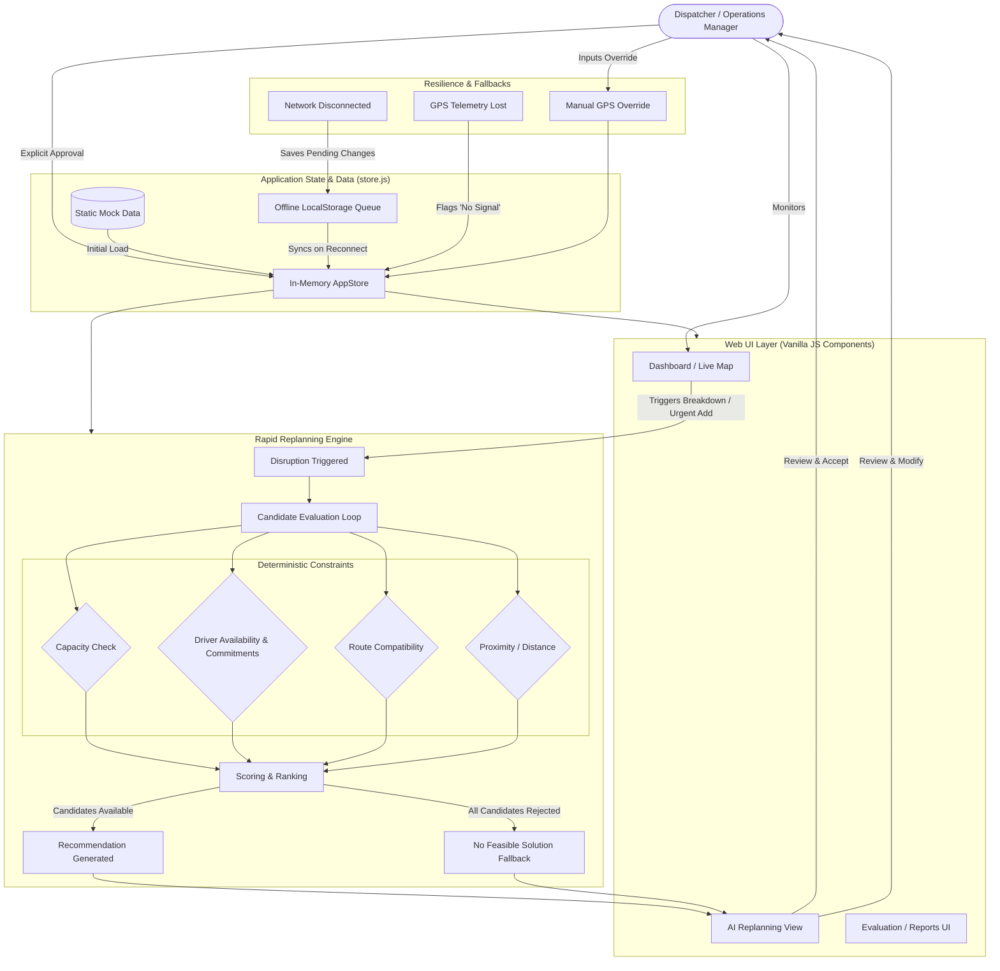

# System Architecture & Workflow Diagram

This document illustrates the actual functional architecture and human-in-the-loop rapid replanning workflow implemented within the application. 

It accurately reflects the in-memory state architecture, the replanning algorithmic flow, the deterministic constraint validations, and the offline fallback capabilities currently present in the codebase.

### Architectural Notes
- **State Management:** The application relies on a single, centralized `AppStore` that handles all state transitions, notifying vanilla JS UI components of changes.
- **Human-in-the-Loop:** The AI recommendation engine evaluates permutations deterministically based on hard constraints, but the Dispatcher must explicitly review the tradeoffs and approve the `aiRecommendation` before the active `routeId` or `busId` state is modified.
- **Resilience:** The architecture natively supports network interruption (queuing changes to LocalStorage) and telemetry failure (falling back to manual checkpoint entry by the Dispatcher).
